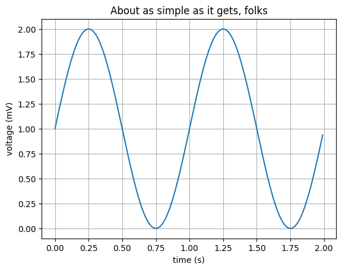

<script>
    window.$docsify = {
        // !!! Your site name on the top-left sidebar corner
        name: "Google",
        // !!! Your site url of the top-right github icon
        repo: "https://www.google.com",

        loadNavbar: false,
        loadSidebar: true,
        loadFooter: true,
        mergeNavbar: true, // navbar will be merged with the sidebar on smaller screens
        subMaxLevel: 5, // sidebar item to show current page headings
        sidebarDisplayLevel: 1, // nested sidebar collapse plugin
        notFoundPage: true, // _404.md will be display if url doesn't exist

        darklightTheme: {
            defaultTheme: "light | dark",
        },

        search: {
            maxAge: 86400000,
            placeholder: "Type to search",
            noData: "No Results!",
            depth: 2,
        },

        timeUpdater: {
          text: ">Last Updated At: {docsify-updated}", 
          formatUpdated: "{YYYY}/{MM}/{DD} {HH}:{mm}:{ss}", 
          whereToPlace: "top",
        },

        pagination: {
          previousText: "Prev Page",
          nextText: "Next Page",
          crossChapter: true,
          crossChapterText: true,
        },
      };
</script>
# This is SHOWCASE.ipynb


```python
import matplotlib.pyplot as plt
import numpy as np
%matplotlib inline
```

## Voltage Curve

some experiments.


```python
t = np.arange(0.0, 2.0, 0.01)
s = 1 + np.sin(2*np.pi*t)
plt.plot(t, s)

plt.xlabel('time (s)')
plt.ylabel('voltage (mV)')
plt.title('About as simple as it gets, folks')
plt.grid(True)
plt.show()

```


    

    


<a href="contents/sample.mp4" target="_blank">Click here to download the video</a>
# Sample Video
<video width="1280" height="720" controls>
    <source src="contents/sample.mp4" type="video/mp4">
    Your browser does not support the video tag.
</video>
