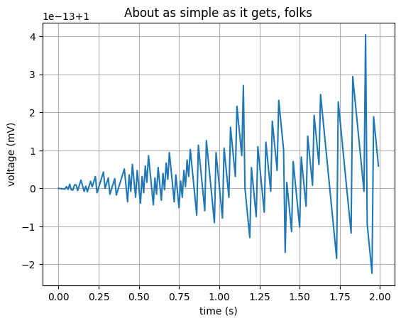

# This is SHOWCASE.ipynb

```python
import matplotlib.pyplot as plt
import numpy as np

print("This is a simple script to plot a sine wave.")
```

    This is a simple script to plot a sine wave.


## Voltage Curve

some experiments.

```python
t = np.arange(0.0, 2.0, 0.01)
s = 1 + np.sin(400*np.pi*t)
plt.plot(t, s)

plt.xlabel('time (s)')
plt.ylabel('voltage (mV)')
plt.title('About as simple as it gets, folks')
plt.grid(True)
plt.show()

```


    

    


<style>
  .github-btn {
    border: none; border-radius: 6px; padding: 16px 32px;
    font-size: 18px; font-weight: 500; cursor: pointer;
    margin: 8px 0; transition: transform 0.1s; letter-spacing: 1px;
  }
  .github-btn:active { transform: scale(0.85) }
</style>
<div style="display:flex; justify-content:center; align-items:center ;text-align: center">
  <a href="https://github.com" target="_blank" style="text-decoration: none">
    <button
      class="github-btn" style="background-color: #e9f2a2; color: #16232a;
        border: none; padding: 10px 20px; font-size: 16px; display: flex;
        align-items: center; cursor: pointer;">
      
      GITHUB CODE
    </button>
  </a>
</div>

<a href="contents/sample.mp4" target="_blank">Click here to view the video from anchor tag.</a>
# Sample Video
<video width="1280" height="720" controls>
    <source src="contents/sample.mp4" type="video/mp4">
    Your browser does not support the video tag.
</video>
